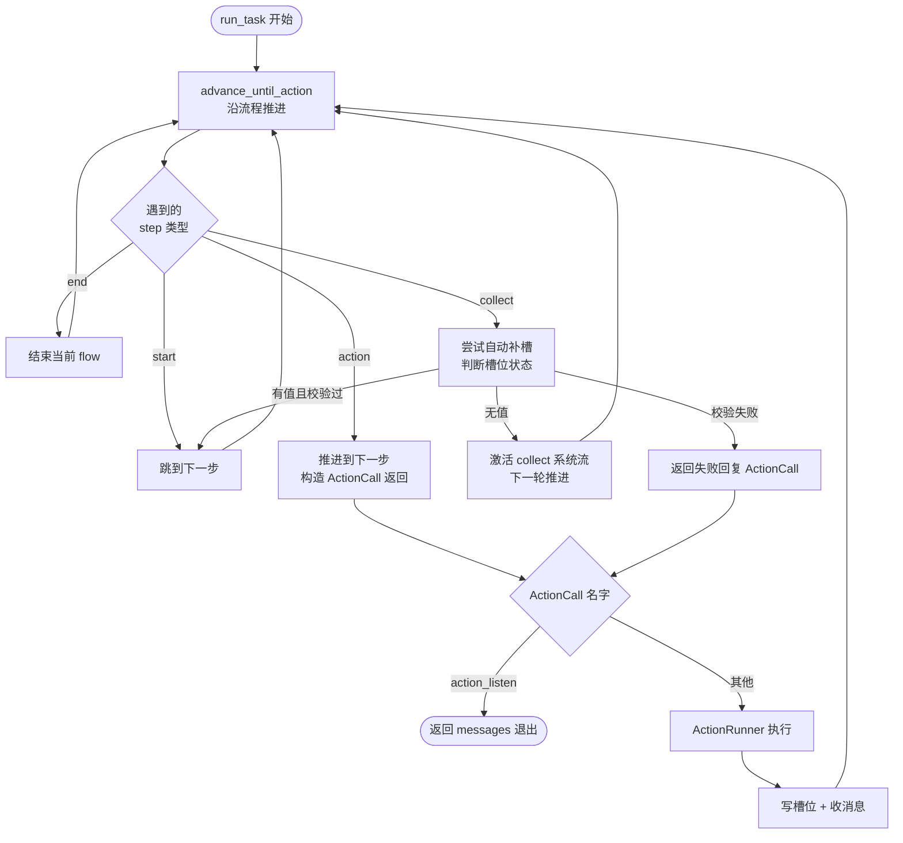
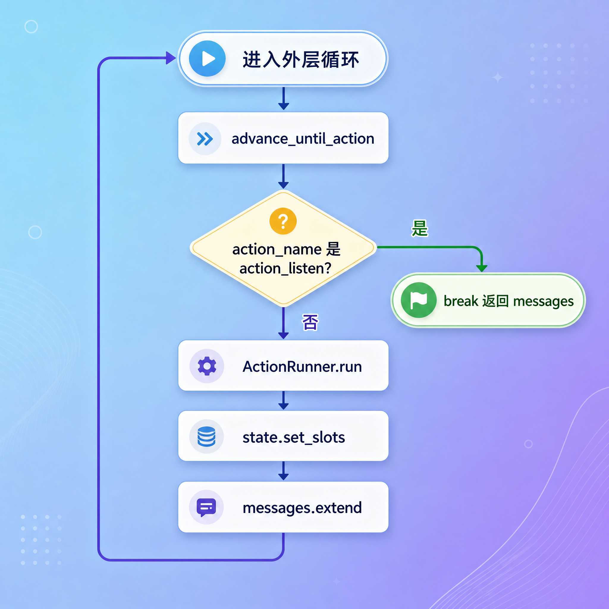
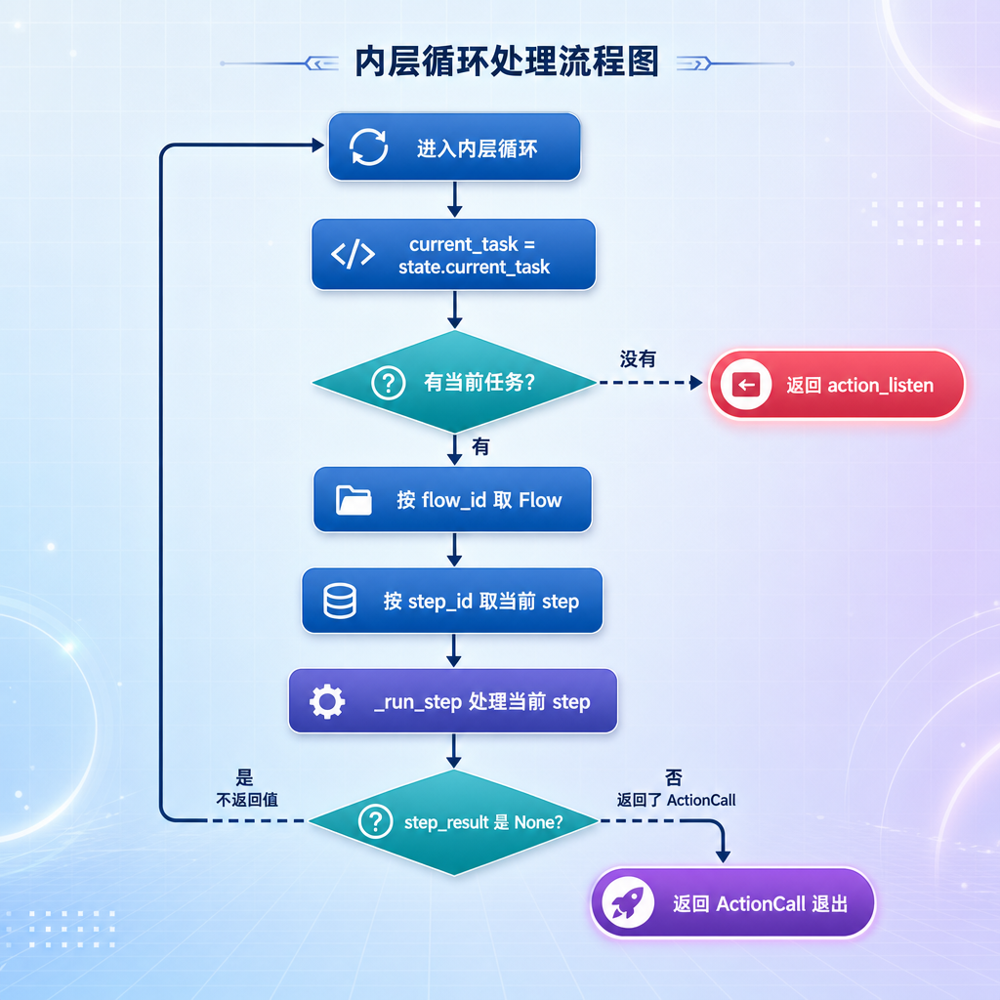
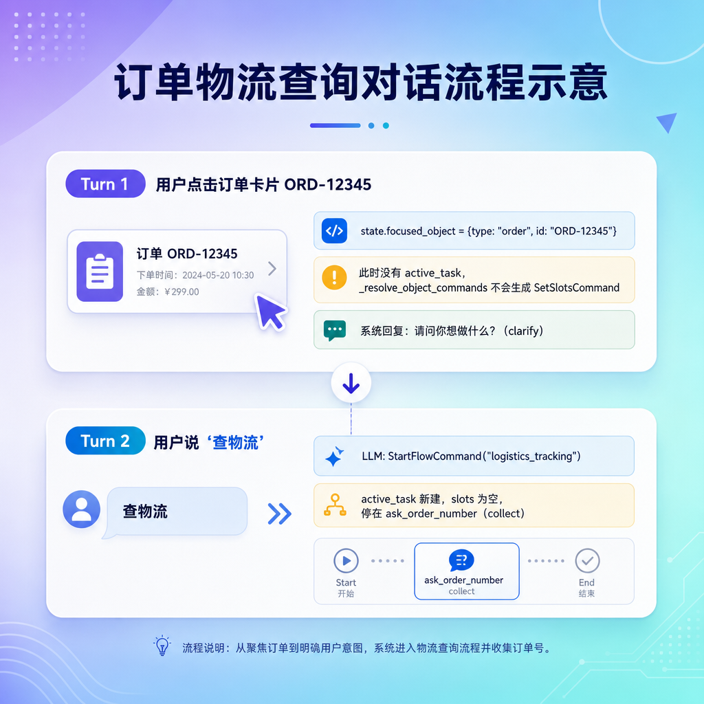
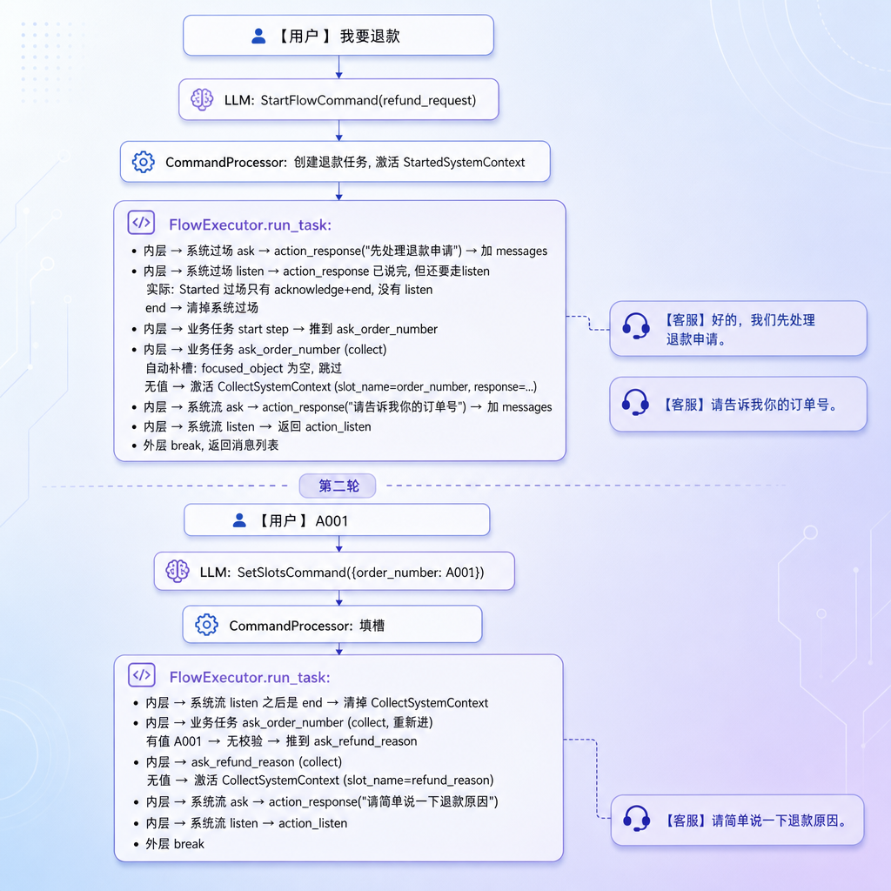
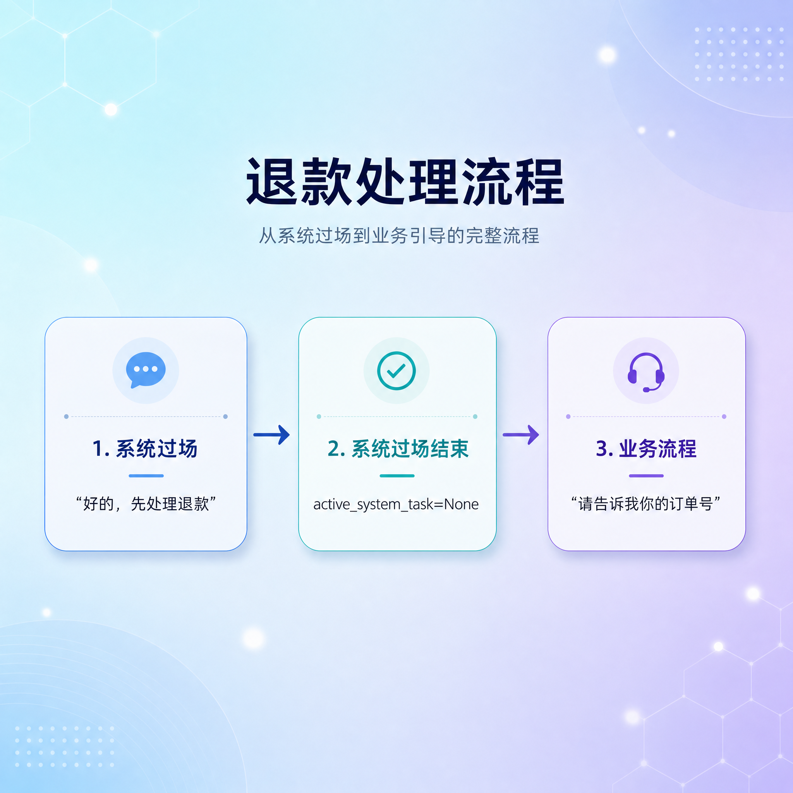
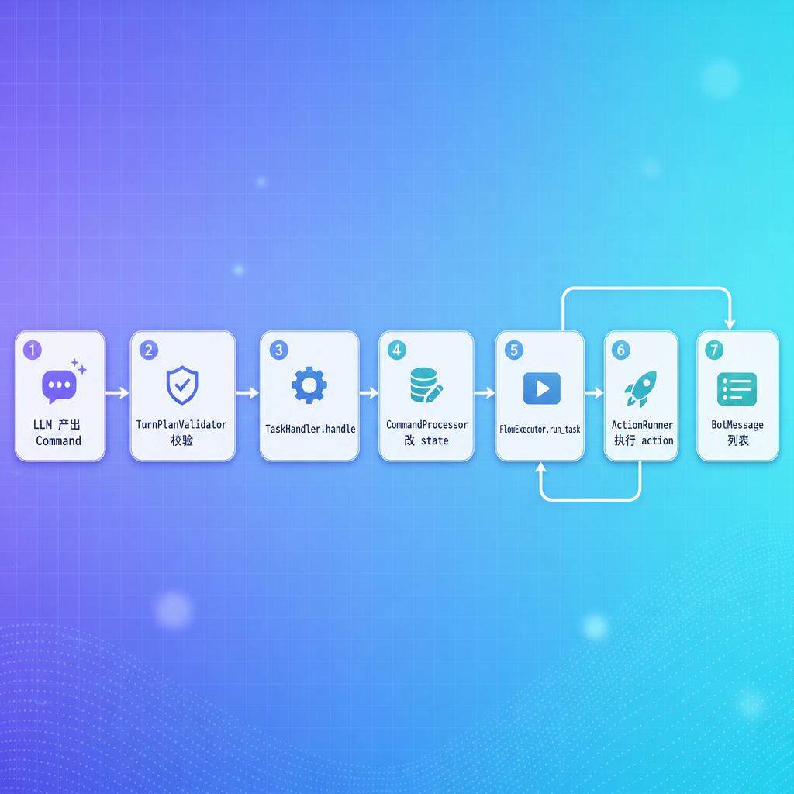

# FlowExecutor 执行器

---

## 第1章 任务目标

到目前为止，我们已经造好了所有"零件"：

- 流程定义（YAML 加载成 `FlowsList`）
- 对话状态（`DialogueState`、各种 Context）
- 命令处理（`CommandProcessor` 改 state）
- 各种动作（`Action` 及其子类）

但还差最关键的一步：**谁把这些零件串起来跑？** 谁去读 state、按 YAML 一步步推进、在该执行 action 时调 ActionRunner、在该等用户时停下来？

如果没有这一层，`CommandProcessor` 改完 state 就结束了——槽位填了、任务建了，但没有人去执行流程、没有人去生成回复。流程定义（YAML）只是一堆静态配置，需要一个人"走"一遍才能变成实际的对话。

这个"工人"，就是这一节的主角——**`FlowExecutor`**。

### 1.1 FlowExecutor 位置

了解 FlowExecutor 在整个系统中的位置，有助于理解它的职责边界。


回顾上一节 `TaskHandler` 的两步：

```python
async def handle(self, commands, state):
    self.command_processor.run(commands, state, self.flows)              # ① 改状态
    messages = await self.flow_executor.run_task(state, ..., action_runner)  # ② 推流程
    return messages
```

`CommandProcessor` 改完状态就退场，`FlowExecutor` 接手——读改好的 state，按 YAML 流程一步步推进，每遇到 action 步骤就交给 `ActionRunner` 真正执行，把回复收集起来，直到该等用户输入了，停下，返回所有回复。

### 1.2 一句话理解

> **沿着 YAML 流程图一直走，遇到要干活的地方就停下来叫人干，遇到要等用户说话就退场。**

定位和直觉都有了，下面拆开看它具体怎么运转。

---

## 第2章 整体执行流程

直接看 FlowExecutor 的核心思路，从最高层往下拆。

### 2.1 两层循环

FlowExecutor 由两个方法协作，构成**两层嵌套循环**，外层管 action、内层管 step。

为什么要拆成两层？因为 step 和 action 的"粒度"不同。一个 step 只是流程图上的一次推进——改个 step_id、判断一下 slot 有没有值——这些操作极快，不需要等待。而 action 是真正的外部工作：调接口、生成回复、等用户输入。如果把两种逻辑混在一个循环里，每一步都要判断"我现在是推进还是执行"，代码会充满 if-else。拆成两层后职责清晰：内层只管推进 step，外层只管执行 action。


| 层 | 谁 | 干什么 | 停下条件 |
| --- | --- | --- | --- |
| 外层 | `run_task` | 调内层拿一个 `ActionCall`，让 ActionRunner 执行它 | 拿到的是 `action_listen` |
| 内层 | `advance_until_action` | 沿流程图一直推进 step，跳过不干活的步骤 | 遇到一个 action 步骤 |

### 2.2 整体流程

把两层循环拉成一张完整的图：




这张图就是 FlowExecutor 的全貌。下面把每一块拆开讲。

### 2.3 三个关键术语

| 术语 | 含义 |
| --- | --- |
| **当前任务** | `state.current_task()`——系统任务优先，系统任务没有就用业务任务 |
| **当前 step** | 当前任务里 `step_id` 指向的那个 YAML 步骤 |
| **action_listen** | 一个特殊的 action 名，作为"该等用户输入了"的信号 |

为什么用 `action_listen` 这个特殊名字而不是返回 `None` 或抛异常？因为 `action_listen` 本质上也是一种"action"——它和查订单、生成回复一样，是动作列表中的一个。把它放到和其他 action 同等的地位，两层循环的退出条件就统一了：**内层只管返回 ActionCall，外层只管执行 ActionCall**。只不过 `action_listen` 的执行方式是"停"而不是"做"。

特别注意"当前任务"的优先级：**系统任务（`active_system_task`）优先于业务任务（`active_task`）**。为什么？因为系统过场（"好的，先处理退款"）要先说出来，再继续业务。

整体框架有了，接下来分层深入。先从外层 `run_task` 看起。

---

## 第3章 run_task：外层循环

### 3.1 代码

```python
async def run_task(self, state, flows, action_runner) -> list[BotMessage]:
    messages: list[BotMessage] = []
    while True:
        action_call: ActionCall = self.advance_until_action(state, flows)
        if action_call.action_name == "action_listen":
            break
        else:
            action_result: ActionResult = await action_runner.run(action_call, state)
            state.set_slots(action_result.slot_updates)
            messages.extend(action_result.messages)
    return messages
```

### 3.2 三件事

外层循环每一轮做三件事：

1. **找下一个要执行的 action**：调 `advance_until_action`，它会沿流程推进，最终返回一个 `ActionCall`
2. **判断要不要退场**：如果拿到的是 `action_listen`，说明该等用户了，break 退出循环
3. **真正干活**：否则交给 `ActionRunner` 执行；把 action 返回的槽位更新写回 state、把消息收进结果列表



### 3.3 为什么是死循环

外层是 `while True`，而不是"遍历一个步骤列表然后结束"。原因在于 FlowExecutor 在执行前不知道这一轮要跑多少个 action。YAML 定义了流程结构，但没有定义"一轮对话停在哪里"——这个边界是由运行时状态决定的。比如用户直接说了订单号，collect 自动跳过，少了一次询问；用户没提供足够信息，collect 激活系统流多了一次追问。

所以用 `while True` + `action_listen` 作为唯一退出条件：**不管中间经历了多少个 action，跑到该等用户了就停**。如果用户一次提供了所有信息（比如"退订单 A001，原因是尺码不对"），一轮对话就能跑完 collect + collect + action_response，中间不需要停下来。

外层负责"执行"，推进工作全在内层。下面打开 `advance_until_action`。

---

## 第4章 advance_until_action：内层循环

这是 FlowExecutor 的**心脏**。它沿着 YAML 流程图一直推，跳过不需要执行 action 的步骤，遇到要执行 action 的步骤就返回。

### 4.1 代码

```python
def advance_until_action(self, state, flows) -> ActionCall:
    while True:
        current_task = state.current_task()  # 系统任务优先
        if current_task is None:
            return ActionCall(action_name="action_listen")

        flow: Flow = flows.get_flow_by_id(current_task.flow_id)
        step: FlowStep = flow.get_step_by_id(current_task.step_id)
        step_result: ActionCall | None = self._run_step(step, state, flows)

        if step_result is not None:
            return step_result
```

### 4.2 一轮内层循环做什么



每一轮的核心逻辑：

| 步骤 | 做什么 |
| --- | --- |
| 取当前任务 | `state.current_task()`，没有就退出（返回 action_listen） |
| 取当前 step | 用任务里的 `step_id` 在 flow 里查 |
| 处理这个 step | `_run_step` 按 step 类型分发处理 |
| 看返回值 | 返回 None → step 不产生 action，**继续循环推下一步**；返回 ActionCall → step 要执行 action，**退出内层** |

### 4.3 没有当前任务的情形

`current_task is None` 时直接返回 `action_listen`——没事可做，等用户输入。

为什么会出现没有当前任务？因为系统不强制"任何时候都必须有一个活跃任务"。流程跑完就是跑完了，这是一个自然的空闲状态。设计上与其引入一个"空闲任务"来占位，不如直接判断 None——更干净，也不会让 state 里残留无意义的占位对象。

两种典型情况：

- 业务流程刚跑完 `end` 步骤，`active_task` 被清空，又没有系统过场
- 用户刚启动会话，根本还没开任何任务

### 4.4 _run_step：按 step 类型分发

```python
def _run_step(self, step, state, flows) -> ActionCall | None:
    if isinstance(step, StartFlowStep):
        return self._run_start_step(step, state)
    if isinstance(step, EndFlowStep):
        return self._run_end_step(state)
    if isinstance(step, CollectSlotStep):
        return self._run_collect_step(step, state, flows)
    if isinstance(step, ActionFlowStep):
        return self._run_action_step(step, state)
```

四种 step 各有处理方法。返回 `None` 表示"这一步不产生 action，请继续推进"，返回 `ActionCall` 表示"该执行这个 action 了"。

四种 step 的处理 vs 返回值：

| step 类型 | 处理 | 返回 None 还是 ActionCall |
| --- | --- | --- |
| `start` | 跳到 next step | None（继续推） |
| `end` | 结束当前 flow | None（继续推） |
| `collect` | 自动补槽 + 槽位判断 | 视情况：有值通过 → None / 失败 → ActionCall(失败回复) / 无值 → None（激活系统流） |
| `action` | 推进 + 构造 ActionCall | **ActionCall** |

后面四章逐个拆解这四种 step 的处理。

内层循环的中枢是 `_run_step` 按类型分发。四种 step 难度不一，从最简单的 `start` 开始。

---

## 第5章 处理 start step

### 5.1 代码

```python
def _run_start_step(self, step, state) -> ActionCall | None:
    self._advance_to_next_step(step, state)
    return None
```

最简单的一种。`start` 步骤本身不干任何活，它只是流程的**入口标记**。处理就两件事：把当前任务的 `step_id` 设成 next step，然后返回 None 让内层循环继续推。

为什么需要一个"什么都不做"的步骤？因为 YAML 流程需要一个确定的、统一的入口点。如果约定"第一个 step 就是入口"，那加载器需要用顺序来推断，一旦 YAML 里 step 顺序调整就会出错。`type: start` 显式标记入口，不管 step 在 YAML 里的顺序如何，框架总能精确定位。

### 5.2 配合 YAML 看

退款流程的开头：

```yaml
- id: start
  type: start
  next: ask_order_number      # 起点直接连到第一个 collect
```

当前 step 是 `start` 时，`_advance_to_next_step` 会读 `next: ask_order_number`，把 task 的 `step_id` 改成 `ask_order_number`。下一轮内层循环就从 `ask_order_number` 这个 collect 步骤开始处理。

### 5.3 推进的本质

`_advance_to_next_step` 是所有 step 推进的公用方法。

```python
def _advance_to_next_step(self, step, state):
    next_step_id = self._select_next_step(step, state)
    state.current_task().step_id = next_step_id
```

它的本质：**改 `step_id`**。流程"推进"在代码里就是这么简单——把当前任务记的 step_id 改成下一个 step 的 id。


### 5.4选择下一步

`_select_next_step` 负责从 `next` 链接中挑出目标 step，条件跳转的核心逻辑就在这里。

```python
def _select_next_step(self, step, state) -> str:
    links: list[FlowStepLink] = step.next
    for link in links:
        if isinstance(link, StaticLink):
            return link.target
        if isinstance(link, ConditionalLink):
            if self._eval_condition(link.condition, state):
                return link.target
        if isinstance(link, FallbackLink):
            return link.target
```

回顾流程加载那一节：每个 step 的 `next` 在加载时被解析成一个 `FlowStepLink` 列表。这里就是按列表遍历，决定走哪个 target：

| 链接类型 | 处理 |
| --- | --- |
| `StaticLink`（YAML 写 `next: xxx`） | 直接返回 target |
| `ConditionalLink`（YAML 写 `- if: ...`） | 表达式为真就返回 target，否则跳过看下一个 |
| `FallbackLink`（YAML 写 `- else: ...`） | 直接返回 target（条件都没满足时的兜底） |

`_eval_condition` 简单粗暴：用 Python `eval` 在 `{slots, context}` 命名空间里跑条件表达式。

```python
def _eval_condition(self, condition, state) -> bool:
    data = {
        "slots": state.active_task.slots,
        "context": asdict(state.current_task()),
    }
    return bool(eval(condition, {}, data))
```

回顾相似商品流程，正好用到条件跳转：

```yaml
- id: start
  type: start
  next:
    - if: "slots.get('product_id')"        # 有商品就推荐
      then: respond
    - else: missing_product_context        # 没有就提示先选商品
```

`_select_next_step` 跑下来，会让 `start` step 根据 `slots.get('product_id')` 走向不同的下一步。

`start` 是入口，对应地 `end` 就是出口。下面看流程怎么收尾。

### 5.5 补充system_cannot_handle 对齐

`_eval_condition` 构建 `context` 的方式值得注意：

```python
def _eval_condition(self, condition, state) -> bool:
    data = {
        "slots": state.active_task.slots,
        "context": asdict(state.current_task())
    }
    return bool(eval(condition, {}, data))
```

`context` 来自 `asdict(state.current_task())`，也就是说条件表达式能访问的 `context` 字段**完全取决于当前任务是什么 Context 类**。`TaskContext` 只有 `flow_id`、`step_id`、`slots`；`SystemContext` 只有 `flow_id`、`step_id`；各个子类如 `CollectSystemContext` 才额外带了 `slot_name`、`response` 等。

这里有一个实际的对齐问题。`system_flows.yml` 中定义了 `system_cannot_handle` 流程：

```yaml
system_cannot_handle:
  steps:
    - id: start
      type: start
      next:
        - if: "context.get('reason') == 'clarification_rejected'"
          then: clarification_rejected
        - if: "context.get('reason') == 'not_supported'"
          then: not_supported
        - if: "context.get('reason') == 'no_relevant_answer'"
          then: no_relevant_answer
        - else: ask_rephrase
      ...
```

但整个 Python 代码中，**没有任何地方激活过 `system_cannot_handle`**。实际澄清逻辑走的是 `ClarifyResponder`（`clarify/responder.py`），它拿到 `ClarifyReason` 后直接调 LLM 改写澄清语返回 BotMessage，完全绕过了 FlowExecutor 和这个系统流。

其次，就算有人想激活它，`contexts.py` 的映射表里也没有对应的 Context 子类：

```python
FLOW_ID_TO_CONTEXT_CLASS = {
    "system_task_started":      StartedSystemContext,
    "system_task_interrupted":  InterruptedSystemContext,
    "system_task_canceled":     CanceledSystemContext,
    "system_task_resumed":      ResumedSystemContext,
    "system_collect_information": CollectSystemContext
    # system_cannot_handle → 缺失
}

# 改造位置
@dataclass
class CannotHandleSystemContext(SystemContext):
      flow_id: str = "system_cannot_handle"
      reason: str | None = None

# 改造位置
FLOW_ID_TO_CONTEXT_CLASS = {
    "system_task_started":      StartedSystemContext,
    "system_task_interrupted":  InterruptedSystemContext,
    "system_task_canceled":     CanceledSystemContext,
    "system_task_resumed":      ResumedSystemContext,
    "system_collect_information": CollectSystemContext
    # system_cannot_handle → 缺失
}
        
# 改造位置
# 把直接调 ClarifyResponder 改成激活系统任务 + 走 FlowExecutor：
if not validation.valid:
    flow = self.task_handler.flows.get_flow_by_id("system_cannot_handle")
    state.start_system_task(CannotHandleSystemContext(
        flow_id="system_cannot_handle",
        step_id=flow.start_step().id,
        reason=validation.reason.value,  # ← 在这里给值
     ))
    return await self.task_handler.handle(commands=[], state=state)

       
```

仅靠基类 `SystemContext`，`asdict()` 只产出 `{"flow_id": "...", "step_id": "..."}`，没有 `reason` 字段。三个 `if` 条件永远为假，永远落进 `else: ask_rephrase`。

要让这个流程跑起来，需要三步：

1. 定义一个带 `reason` 字段的 Context 子类并在映射表中注册
2. 在 `dialogue_engine.py` 中把 `ClarifyResponder.respond()` 替换为激活 `system_cannot_handle` 系统任务，将 `validation.reason` 传入 Context
3. YAML 条件就能从 `context.get('reason')` 正常取值，实现条件化澄清

这个流程之所以以"半成品"状态留在 YAML 里，说明早期设计是走 FlowExecutor 体系的，后来澄清逻辑被拆到了独立的 `ClarifyResponder`，但 YAML 定义没有同步清理。

`start` 是入口，对应地 `end` 就是出口。下面看流程怎么收尾。


---

## 第6章 处理 end step

### 6.1 代码

```python
def _run_end_step(self, state) -> ActionCall | None:
    if state.active_system_task:
        state.end_system_task()
        return None
    else:
        state.end_active_task()
        return None
```

`end` 步骤标志一个 flow 跑完了，按"当前是系统流还是业务流"分别清掉。

为什么不能统一处理？因为两种 end 的语义完全不同。系统流（如过场"好的，先处理退款"）是一个**临时叠加层**，它结束时业务任务还在下面等着，所以只清系统任务。业务流的 end 意味着用户请求的整个任务完成了，要清掉的是业务任务本身。如果系统流 end 也调 `end_active_task()`，那每次说完过场话，业务任务就一起被误杀了。

| 当前 | 处理 |
| --- | --- |
| 系统任务（如"先处理退款"过场跑完） | `end_system_task()` 清掉系统过场，业务流接着跑 |
| 业务任务（如退款流程到 end） | `end_active_task()` 清掉活跃任务 |

清掉之后返回 None。下一轮内层循环再调 `state.current_task()`：

- 业务结束 → 如果暂停栈还有任务可能要恢复，否则就没事了，返回 `action_listen`
- 系统过场结束 → 业务任务还在，继续推进业务

### 6.2 一个完整的场景

退款申请的最后两步：

```yaml
- id: refund_submitted
  type: action
  action: action_response
  args:
    text: "好的，订单{{ slots.order_number }}的退款申请已提交..."
  next: end
- id: end
  type: end
  next: []
```

执行顺序：

1. 跑 `refund_submitted` → 返回 ActionCall(action_response) 给外层 → 外层执行（生成回复）→ 内层循环继续
2. 内层下一轮：当前 step 已经因为 `_run_action_step` 推进过了，现在停在 `end`
3. `_run_end_step` 调 `end_active_task()` 清空活跃任务
4. 再下一轮：`current_task()` 为 None（如果没有挂起任务）→ 返回 `action_listen` → 外层退出

注意这里和 `system_collect_information` 系统流的区别：`system_task_started` 过场流没有 `listen` 步骤，说完话直接 `end`。因为它是"顺带说一句"，不需要等用户回复——说完"好的，先处理退款申请"就该接着问订单号了。而 `system_collect_information` 有 `listen` 步骤，因为它说完问句后**必须等用户回答**。同样是系统流，"一问一答"和"通知一声"的角色不同，体现在 YAML 里有没有 `action_listen`。

入口和出口都简单直接。真正的复杂度在中间——`collect` 步骤，它要应对槽位的所有可能状态。

---

## 第7章 处理 collect step（最复杂）

`collect` 是四种 step 里最复杂的一个。因为它要处理"槽位的所有可能状态"：刚来时可能本来就有值、可能从聚焦对象自动补一个、可能有值但没通过校验、可能完全没值。

### 7.1 代码

```python
def _run_collect_step(self, step, state, flows) -> ActionCall | None:
    self._try_to_fill_slot_from_focused_object(step, state)
    if state.active_task.slots.get(step.slot_name):
        # ===== 有值 =====
        if step.validation:
            if self._eval_condition(step.validation.condition, state):
                # 校验通过 → 推进到下一步
                self._advance_to_next_step(step, state)
                return None
            else:
                # 校验失败 → 清空槽位 + 给失败回复
                state.remove_slot(step.slot_name)
                if step.validation.failure_response:
                    return ActionCall(action_name="action_response",
                                      action_kwargs=asdict(step.validation.failure_response))
                return ActionCall(action_name="action_response",
                                  action_kwargs={"text": "你提供的信息有误，请重新输入。"})
        else:
            # 无校验规则,直接推进
            self._advance_to_next_step(step, state)
            return None
    else:
        # ===== 无值 → 激活系统收集流程 =====
        state.start_system_task(CollectSystemContext(
            flow_id="system_collect_information",
            step_id=flows.get_flow_by_id("system_collect_information").start_step().id,
            slot_name=step.slot_name,
            response=asdict(step.response),
        ))
        return None
```

### 7.2 整体处理流程


下面把每一段拆开讲。

### 7.3 第一步：尝试自动补槽

```python
def _try_to_fill_slot_from_focused_object(self, step, state):
    if state.focused_object is None:
        return
    if step.slot_name == 'order_number' and state.focused_object.type == "order":
        state.set_slots({step.slot_name: state.focused_object.id})
    if step.slot_name == "product_id" and state.focused_object.type == "product":
        state.set_slots({step.slot_name: state.focused_object.id})
```

进入 collect step 第一件事：看看 `focused_object` 能不能直接提供这个槽位的值。

**它要解决什么问题？** 考虑一个真实的交互顺序：用户在首页先点了一张订单卡片，然后说"查物流"。这个交互跨了两个 turn：



如果在 collect step 不做自动补槽，会发生什么？用户**已经点过订单卡片了**，但进流程后系统还要再问一遍"请告诉我你的订单号"。用户会困惑：我刚不是点了吗？

`_try_to_fill_slot_from_focused_object` 就是为这个场景设计的。它利用 `focused_object` **跨 turn 持久化**的特性（只有 session 过期才清），在 collect step 被处理时顺手检查一下——如果用户的聚焦对象恰好匹配这个槽位，直接填入，省掉一次追问。

那如果用户在流程中点击卡片呢？那种情况 `_resolve_object_commands` 已经通过 `SetSlotsCommand` 填过了，这里的自动补槽是冗余但无害的二次保险。两条路径覆盖了"点击卡片"的所有时序，确保不管用户先点还是后点，卡片信息都不会被浪费。

### 7.4 第二步：有值的处理

有值后看配没配 `validation`：

**情况 A：没配校验** → 直接推进到下一步。最常见，user_flows.yml 里的 collect 步骤都没配校验。

```yaml
- id: ask_order_number
  type: collect
  slot_name: order_number
  response:
    text: "请告诉我你的订单号。"
  next: ask_refund_reason
```

槽位填到 `order_number` 后，直接跳到 `ask_refund_reason` 这一步。

**情况 B：配了校验且通过** → 推进。

**情况 C：配了校验但失败** → 清空槽位 + 返回 `action_response` ActionCall 给用户发失败提示。

这里"清空槽位"很关键，不能省略。如果不清空，槽位里还残留着那个未通过校验的值，下一轮内层循环再进这个 collect step 时，`slots.get(step.slot_name)` 仍然为真 → 又走"有值"分支 → 校验又失败 → 又返回失败 ActionCall → 外层执行 → 内层又进同一个 collect → **死循环**。清空之后，下一轮就回到"无值"状态，重新激活系统收集流再问用户一次——这形成了一个自然的"重试"机制。

### 7.5 无值的处理

槽位为空时，collect step 激活一个系统任务来向用户提问。

```python
state.start_system_task(CollectSystemContext(
    flow_id="system_collect_information",
    ...
))
return None
```

为什么这里不直接返回一个 `ActionCall(action_response, "请告诉我你的订单号")`？那样不是更直接吗？

不行。因为如果直接返回 action_response，业务 collect step 已经"跳过了"——`step_id` 要么推走要么没推，等用户回复回来后，框架不知道要回到哪个 step 继续。collect step 需要的是**暂停业务流、问问题、等回复、回到同一个 step 检查槽位**。

系统流的机制恰好提供了这个能力。激活 `CollectSystemContext` 后：

1. 业务 task 的 `step_id` 不动——仍然停在当前 collect step
2. 系统流接管：问问题 → action_listen 停下
3. 下一轮对话，系统流的 end 清掉自己
4. 业务任务原封不动地回来，停在同一个 collect step
5. 此时 slot 已被 `CommandProcessor` 填入 → 走"有值"分支推进

这就是第 9 章要专门讲的"系统任务优先"设计在 collect 场景的具体应用——**系统流是业务流的"暂停层"，不修改业务流的 step_id，只借道说一句话**。

回顾 `system_flows.yml` 里这个系统流：

```yaml
system_collect_information:
  steps:
    - id: ask
      type: action
      action: action_response
      args: context.response       # ← 读 context.response 当 args
      next: listen
    - id: listen
      type: action
      action: action_listen        # 停下来等用户输入
      next: end
```

它做两件事：用 `action_response` 问用户、用 `action_listen` 停下等回答。系统流里的 `context` 就是刚激活的 `CollectSystemContext`，所以 `args: context.response` 取到的就是 collect step 当时传的 `response`。

整个 collect 的等待用户输入流程是这样：


之后用户回答了订单号，下一轮对话进来时：LLM 把"A001"识别成 `SetSlotsCommand` → `CommandProcessor` 填进槽位 → `FlowExecutor.run_task` 再次跑起来 → 内层循环 → 业务任务（系统过场已结束）的 `order_number` 现在有值了 → 推进。

### 7.6 完整流程

把 7.3-7.5 串成一个对话来看：



这就是 collect step 在真实对话里的工作方式：**每个槽位都会经历一次"无值激活系统流问→等用户答→有值推进"的循环**。

`collect` 负责收信息，收齐之后就该真正干活了。最后一种 step——`action`，是执行动作的地方。

---

## 第8章 处理 action step

### 8.1 代码

```python
def _run_action_step(self, step, state) -> ActionCall | None:
    self._advance_to_next_step(step, state)              # ① 先推进 step_id
    action_call: ActionCall = self._build_action_call(step, state)  # ② 再构造 ActionCall
    return action_call                                   # ③ 退出内层让外层执行
```

### 8.2 顺序为什么重要

注意代码里的执行顺序：**先 `_advance_to_next_step` 把 step_id 推到下一步，再构造 ActionCall 返回**。

如果不先推进，外层执行完 action 后内层下一轮还是停在同一个 action step 上，会**死循环**反复执行同一个 action。先推进掉，外层执行完回来时，内层从下一个 step 开始。


构造 ActionCall 用的是**当前** step 的 action 和 args（虽然 step_id 已经推走了，step 局部变量还是那个对象）。

### 8.3 _build_action_call：构造 ActionCall

```python
def _build_action_call(self, step, state) -> ActionCall:
    action_name = step.action
    args = step.args
    if isinstance(args, str):
        args = asdict(state.current_task())[args.split('.')[1]]
    return ActionCall(action_name=action_name, action_kwargs=args)
```

正常情况下 `step.args` 是个 dict，直接当 action_kwargs 传。但有一种特殊情况：`args` 写成了字符串 `"context.response"`，需要从当前任务的对应字段里取出来。

这正是 7.5 节里 `system_collect_information` 用的写法：

```yaml
- id: ask
  type: action
  action: action_response
  args: context.response       # ← 字符串引用,不是 dict
```

代码里 `args.split('.')[1]` 取 `"response"`，再 `asdict(state.current_task())["response"]`——也就是从当前 `CollectSystemContext` 里取出 `response` 字段（这正是激活系统流时塞进来的那份 response）。

这种"间接引用"解决了一个实际问题：**同一个系统流如何服务不同的业务场景**。`system_collect_information` 只有一个，但几十个业务 collect step 的问句各不相同——"请告诉我你的订单号""请简单说一下退款原因"。如果把问句写死在系统流的 YAML 里，每个 collect step 都需要一个独立的系统流。通过 `context.response` 间接引用，问句变成了激活系统流时传入的参数，一个系统流通用于所有 collect step。

### 8.4 配合 YAML 看

最简单的 action step：

```yaml
- id: lookup_order_status
  type: action
  action: action_lookup_order_status
  next: show_order_status
```

跑这步时：

1. step_id 推到 `show_order_status`
2. 构造 `ActionCall(action_name="action_lookup_order_status", action_kwargs={})`（args 没写就是空 dict）
3. 返回给外层
4. 外层调 ActionRunner 跑 `LookupOrderStatusAction`，查订单接口，把状态写进槽位
5. 外层继续循环 → 内层从 `show_order_status` 开始

带模板的 action step：

```yaml
- id: show_order_status
  type: action
  action: action_response
  args:
    text: "订单{{ slots.order_number }}当前状态是：{{ slots.order_status }}。"
  next: end
```

`args` 是 dict，直接当 kwargs 传给 `ActionResponse`，里面的 Jinja2 模板由 `ActionResponse._render_text` 渲染。

四种 step 都讲完了。但还有一个贯穿全部的设计没有细说——系统任务为什么总是优先。

---

## 第9章 系统任务优先

整个 FlowExecutor 里反复出现的一个关键设计：**`current_task()` 优先返回系统任务**。

### 9.1 实现

```python
# state.current_task() 大致逻辑:
def current_task(self):
    return self.active_system_task or self.active_task
```

一行代码就完成了优先级编码：Python 的 `or` 短路求值，左边有值就返回左边，左边为 None 才取右边。这样做的好处是不需要到处写 `if active_system_task: ... else: ...` 的分支判断——所有调用方统一通过 `current_task()` 取值，优先级规则集中在一处，改起来也只改一处。

### 9.2 设计意图

考虑这个场景：用户说"我要退款"，CommandProcessor 处理完后：

```python
active_task        = TaskContext(flow_id="refund_request", step_id="start")
active_system_task = StartedSystemContext(flow_id="system_task_started", step_id="start")
```

两个任务**同时存在**。FlowExecutor 应该先跑哪个？

直觉上：先让系统说"好的，先处理退款"，再开始业务流程问订单号。所以**系统任务优先**——它代表"系统要先说的话"，跑完才轮到业务。



整个 FlowExecutor 围绕这个优先级运行：每次内层循环都重新调 `current_task()`，所以当系统过场跑到 end 步骤、`active_system_task` 被清空后，下一轮就自然切回业务任务推进。

### 9.3 推广到 Collect

7.5 节讲的 `CollectSystemContext` 也是利用这个优先级：业务 collect step 发现无值 → 激活 CollectSystemContext → 下一轮 `current_task()` 返回系统任务 → FlowExecutor 跑系统流去问用户。系统流结束（end 步骤清空 `active_system_task`）→ 回到业务 collect step 检查是否填上了。

**优先级让"系统插话"和"业务流程"在同一个执行框架里和平共处**——不需要额外的中断/恢复机制，就是简单的"系统优先于业务"。

设计层面都讲清楚了。下面用一个完整对话把所有概念串起来跑一遍。

---

## 第10章 完整对话推演

把所有内容串成一个完整对话，看 FlowExecutor 怎么一步步推。场景：用户走完整个"查订单状态"流程。

### 10.1 第一轮：用户发起

```text
[用户] 查一下订单 A001 的状态
```

LLM 拆出两个命令：

```python
[
    StartFlowCommand(flow="order_status_query"),
    SetSlotsCommand(slots={"order_number": "A001"}),
]
```

CommandProcessor 处理后：

```python
active_task        = TaskContext("order_status_query", "start", slots={"order_number": "A001"})
active_system_task = StartedSystemContext(...)  # "好的,先处理订单状态查询"
```

`FlowExecutor.run_task` 开始跑：

| 内层轮 | current_task | 当前 step | 处理 | 返回 |
| --- | --- | --- | --- | --- |
| 1 | system | start | start_step → 推到 acknowledge | None |
| 2 | system | acknowledge | action_step → 推到 end + 构造 ActionCall(action_response, "好的,先处理订单状态查询。") | **ActionCall** |

外层执行 action_response，得到一条消息加入 messages。外层继续：

| 内层轮 | current_task | 当前 step | 处理 | 返回 |
| --- | --- | --- | --- | --- |
| 3 | system | end | end_step → 清掉系统任务 | None |
| 4 | active_task | start | start_step → 推到 ask_order_number | None |
| 5 | active_task | ask_order_number (collect) | order_number 已有值 A001 → 推到 lookup_order_status | None |
| 6 | active_task | lookup_order_status (action) | 推到 show_order_status + 构造 ActionCall(action_lookup_order_status) | **ActionCall** |

外层执行查订单：`slot_updates = {order_status: "已发货", order_summary: "..."}`，写回 state。外层继续：

| 内层轮 | current_task | 当前 step | 处理 | 返回 |
| --- | --- | --- | --- | --- |
| 7 | active_task | show_order_status (action) | 推到 end + 构造 ActionCall(action_response, "订单A001当前状态是：已发货。...") | **ActionCall** |

外层执行 action_response，把"订单状态"消息加入 messages。继续：

| 内层轮 | current_task | 当前 step | 处理 | 返回 |
| --- | --- | --- | --- | --- |
| 8 | active_task | end | end_step → 清掉 active_task | None |
| 9 | current_task = None | — | — | **ActionCall(action_listen)** |

外层拿到 action_listen → break → 返回 messages：

```text
[客服] 好的,我们先处理订单状态查询。
[客服] 订单A001当前状态是：已发货。订单金额 ¥99。
```

### 10.2 这次推演说明了什么

| 现象 | 揭示了什么 | 为什么重要 |
| --- | --- | --- |
| 内层跑了 9 轮才退出 | 一轮用户消息可能驱动很多个 step | 用户不需要和每个 step 交互，系统自动推进中间步骤 |
| 系统任务先跑完才轮到业务 | "系统任务优先"在控制流上的体现 | 过场话和业务逻辑天然分层，不需要特殊调度 |
| 没问订单号就直接查 | 因为 `set_slots` 已经填了，collect 直接通过 | 信息在进入流程前就收集好了，不多问一句废话 |
| 一共生成两条消息 | 系统过场一条 + 业务回复一条 | 多个 action 的输出合并到一轮返回，用户体验连贯 |

这次推演还揭示了一个关键点：**FlowExecutor 的职责不是"运行整个对话"，而是"运行到下一次需要用户输入为止"**。它不会等着用户——用户的消息进来前，FlowExecutor 已经退场了。下一轮对话是一个全新的调用，从头进入 `run_task`。FlowExecutor 本身是无状态的，状态全在 `DialogueState` 里。

推演跑通了一条完整链路，下面做收尾总结。

---

## 第11章 小结

### 11.1 这一节实现了什么

| 文件 | 内容 |
| --- | --- |
| `task/flow/executor.py` | `FlowExecutor` 全部方法：`run_task` / `advance_until_action` / `_run_step` / 四个 `_run_*_step` / `_select_next_step` / `_eval_condition` / `_advance_to_next_step` / `_build_action_call` / `_try_to_fill_slot_from_focused_object` |

### 11.2 几个值得记住的设计

1. **两层循环**：外层管 action 执行，内层管 step 推进。`action_listen` 是唯一的退出信号。这样拆是因为 step 推进和 action 执行是两种不同粒度的操作——把它们混在一起会让每一步都做类型判断。
2. **系统任务优先**：`current_task()` 优先返回系统任务。用一行 `or` 短路求值，让系统过场和 collect 追问能在业务流程之上"覆盖"执行，不需要中断/恢复框架。
3. **action step 先推进再返回**：先改 `step_id` 再构造 `ActionCall`。顺序如果反过来，外层执行完 action 后内层会停在同一个 action step 上，产生死循环。
4. **collect 的三态**：无值（激活系统流问）/ 有值校验通过（推进）/ 有值校验失败（清空 + 失败回复）。清空槽位是防止校验失败后陷入死循环的关键——下一轮无值才能重新追问。
5. **自动补槽**：进 collect step 第一件事尝试从 `focused_object` 填。解决的是"用户先点卡片、后说意图"的跨 turn 场景——focused_object 跨 turn 持久化，collect step 主动检查它。
6. **统一的"系统流"机制**：开始/打断/恢复/取消/收集，都用同一套激活 SystemContext → FlowExecutor 跑系统 flow → end 后清掉。复用同一套执行机制，每种场景只需定义不同的 YAML 和 Context 类。

### 11.3 至此整个 task 轨道完整了

回看整条链路：



从用户说"我要退款"到客服回出"请告诉我你的订单号"，所有齿轮都对上了。（整个客服系统的核心逻辑业务任务处理器实现完毕）下一节就可以把KnowledgeHandler、以及ChitChatHandler两个简单的轨道处理器接入进来，形成完整闭环。
