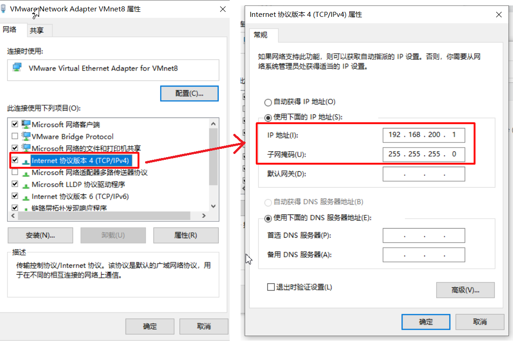
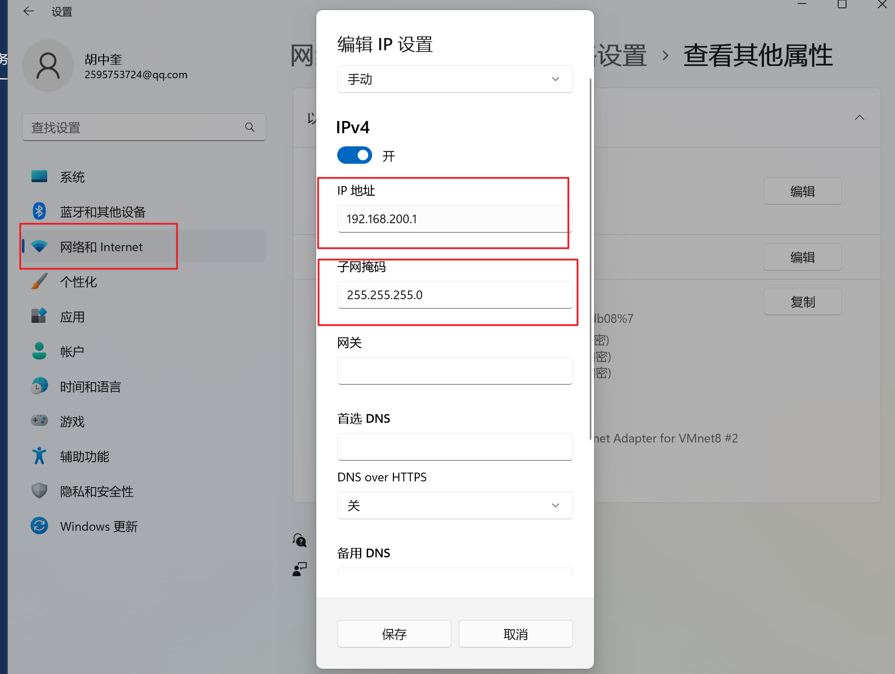
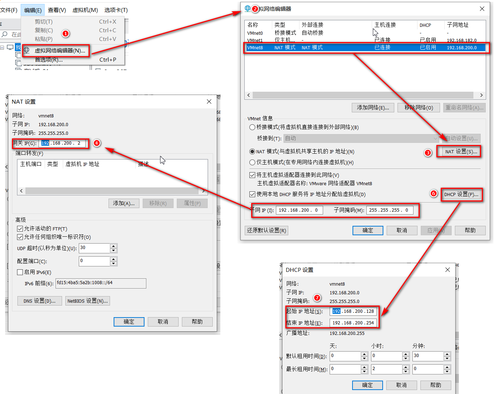
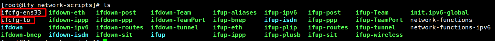
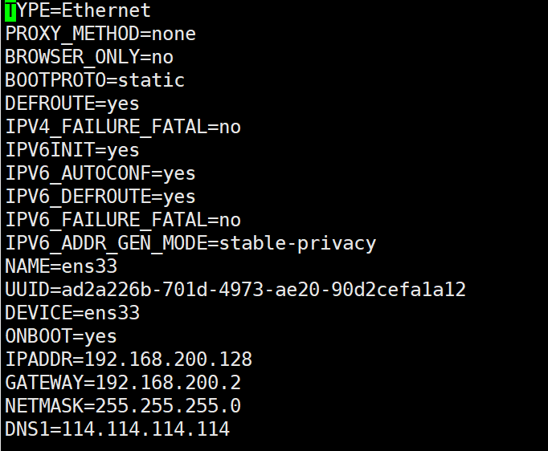

# 	听书软件环境安装

## 一、统一虚拟机设置

### 1、修改VMnet8网卡

**windows10**



**windows11**




### 2、确认网卡信息




### 3、修改静态Ip

```sh
网卡所在目录
cd  /etc/sysconfig/networks-scripts

ls
```




```sh
# 如上图，则修改ens33即可，下面为模板，
# 需要注意的字段。
#  ONBOOT=yes               IPADDR=192.168.200.128      GATEWAY=192.168.200.2 
#  NETMASK=255.255.255.0    DNS1=114.114.114.114        BOOTPROTO=static
TYPE=Ethernet
PROXY_METHOD=none
BROWSER_ONLY=no
BOOTPROTO=static
DEFROUTE=yes
IPV4_FAILURE_FATAL=no
IPV6INIT=yes
IPV6_AUTOCONF=yes
IPV6_DEFROUTE=yes
IPV6_FAILURE_FATAL=no
IPV6_ADDR_GEN_MODE=stable-privacy
NAME=ens33
UUID=ad2a226b-701d-4973-ae20-90d2cefa1a12
DEVICE=ens33
ONBOOT=yes
IPADDR=192.168.200.128
GATEWAY=192.168.200.2
NETMASK=255.255.255.0
DNS1=114.114.114.114

### 你的网卡至少可以为
BOOTPROTO=static
DEFROUTE=yes
NAME=ens33
UUID=b8fd5718-51f5-48f8-979b-b9f1f7a5ebf2
DEVICE=ens33
ONBOOT=yes
IPADDR=192.168.200.128
GATEWAY=192.168.200.2
NETMASK=255.255.255.0
DNS1=114.114.114.114

```




### 4、用xshell等工具连接

> 设置完静态Ip后，使用Xshell等连接工具连接即可。

```sh
hostnamectl set-hostname hzk
UTC=false #设置为false，硬件时钟不于utc时间一致

ARC=false
```

> 若Xshell连接不上,常见问题如下：
>
> reason1:
>
> 检查防火墙状态是否为已关闭 systemctl status firewalld
>
> reason2:
>
> 检查本地Vmnet8网卡的Ip是否和虚拟机的静态Ip在同一个网段
>
> 


------


## 二、安装**Docker**

> 官方文档：https://docs.docker.com/engine/reference/commandline/docker/

### 0、修改yum源

```sh
yum clean all
yum makecache
```


### 1、移除之前的Docker和有关依赖

```sh
sudo yum remove docker *
```


### 2、安装Docker repository

```sh
sudo yum install -y yum-utils
sudo yum-config-manager \
    --add-repo \
    https://download.docker.com/linux/centos/docker-ce.repo	
    # 换做下面阿里云docker仓库地址
    http://mirrors.aliyun.com/docker-ce/linux/centos/docker-ce.repo
```


### 3、安装Docker Engine

```sh
sudo yum install docker-ce docker-ce-cli containerd.io docker-compose-plugin -y
```


### 4、开启Docker

```sh
sudo systemctl enable docker --now

#和上面等价
sudo systemctl start docker
systemctl enable docker
```


### 5、开启镜像加速器

```sh
sudo mkdir -p /etc/docker
sudo tee /etc/docker/daemon.json <<-'EOF'
{
  "registry-mirrors": ["https://dockerproxy.cn"]
}
EOF
sudo systemctl daemon-reload
sudo systemctl restart docker
```


------


## 三、部署中间件

### 1、安装MySQL

**启动容器：**

```sh

docker run -p 3306:3306 --name mysql-01 \
-v /mydata/mysql-01/log:/var/log/mysql \
-v /mydata/mysql-01/data:/var/lib/mysql \
-v /mydata/mysql-01/conf:/etc/mysql/conf.d \
-e MYSQL_ROOT_PASSWORD=root \
--restart=always \	
-d mysql:8.0.29
```


**修改配置文件：**

```cnf

vim /mydata/mysql-01/conf/default.cnf

[client]
default-character-set=utf8mb4
 
[mysql]
default-character-set=utf8mb4
 
[mysqld]
init_connect='SET collation_connection = utf8mb4_unicode_ci'
init_connect='SET NAMES utf8mb4'
character-set-server=utf8mb4
collation-server=utf8mb4_unicode_ci
skip-character-set-client-handshake
skip-name-resolve
```


远程连接

```sh
##3、设置root远程连接
#1、进入master容器
docker exec -it mysql /bin/bash
#2、进入mysql内部 
mysql –uroot -p
	#1）、授权root可以远程访问
grant all privileges on *.* to 'root'@'%' identified by 'root' with grant option;
flush privileges;

   mysql> grant all privileges on *.* to 'root'@'%' identified by 'root' with grant option;

```


------


### 2、安装Redis

```sh
## 1、准备redis配置文件内容
mkdir -p /mydata/redis-01/conf && vim /mydata/redis-01/conf/redis.conf


#开启持久化
appendonly yes
requirepass hzk123456
```


```sh
docker run -d -p 6379:6379 --restart=always \
-v /mydata/redis-01/conf/:/etc/redis/conf \
-v  /mydata/redis-01/data:/data \
--name redis-01 redis:7.0.10 \
redis-server /etc/redis/conf/redis.conf
```


------


### 3、安装RabbitMQ

**第一步：**

```sh
docker run -d --name=myrabbitmq -p 5672:5672 -p 15672:15672 rabbitmq:3.12.0-management --restart=always
```


**第二步：**

安装延迟插件

1. 首先下载rabbitmq_delayed_message_exchange-3.12.0.ez文件上传到RabbitMQ所在服务器，下载地址：https://www.rabbitmq.com/community-plugins.html         

   **注意：也可以使用课件资料/rabbitmq插件目录中下载好的**

2. 切换到插件所在目录，执行` docker cp rabbitmq_delayed_message_exchange-3.12.0.ez spzx_rabbitmq:/plugins `命令，将刚插件拷贝到容器内plugins目录下

3. 执行` docker exec -it myrabbitmq /bin/bash `命令进入到容器内部

4. 执行` cd plugins `进入plugins目录,然后执行` ls -l|grep delay  `命令查看插件是否copy成功

5. 在容器内plugins目录下，执行` rabbitmq-plugins enable rabbitmq_delayed_message_exchange  `命令启用插件

6. exit命令退出RabbitMQ容器内部，然后执行` docker restart myrabbitmq命令重启RabbitMQ容器

------


### 4、安装ElasticSearch

**第一步：拉取镜像**

```sh
docker pull elasticsearch:8.5.0
```


**第二步：新建三个文件夹，并授权**

```sh

mkdir -p /mydata/elasticsearch/{config,plugins,data}

chmod -R 777 /mydata/elasticsearch
```


**第三步：编辑配置文件**

```yaml
cat <<EOF> /mydata/elasticsearch/config/elasticsearch.yml
xpack.security.enabled: true
xpack.license.self_generated.type: basic
xpack.security.transport.ssl.enabled: false  # 不配报错
xpack.security.enrollment.enabled: true
http.host: 0.0.0.0
EOF
```


**第四步：启动容器**

```sh
# 创建自定义网络
 docker network create mynet
# 启动容器 
docker run --name elasticsearch -p 9200:9200 -p 9300:9300 \
--net mynet \
--restart=always \
-e "discovery.type=single-node" \
-e ES_JAVA_OPTS="-Xms2048m -Xmx2048m" \
-v /opt/elasticsearch/config/elasticsearch.yml:/usr/share/elasticsearch/config/elasticsearch.yml \
-v /opt/elasticsearch/data:/usr/share/elasticsearch/data \
-v /opt/elasticsearch/plugins:/usr/share/elasticsearch/plugins \
-v haha:/usr/share/elasticsearch/logs
-d elasticsearch:8.5.0
```


**第五步：连接测试**

```sh
# 重置下面两个密码，注意：需等待es启动
docker exec -it elasticsearch bin/elasticsearch-reset-password -u elastic  -i  # -i 表示自定义密码 给java客户端用的
docker exec -it elasticsearch bin/elasticsearch-reset-password -u kibana_system -i  # 给 kibana 用的

用户名: elastic 密码可以使用: 111111
```


**第七步：安装中文分词器插件**

```sh
#1、下载ik分词插件
https://github.com/medcl/elasticsearch-analysis-ik/releases/tag/v8.5.0

#2、解压
unzip -d ik elasticsearch-analysis-ik-8.5.0.zip

#3、复制到容器内部plugins目录
docker cp ik 容器id:/usr/share/elasticsearch/plugins

#4、重启es
docker restart 容器id
```


------


### 5、安装Kibana

**第一步：拉取镜像**

```sh
docker pull kibana:8.5.0
```


**第二步：新建二个文件夹**

```
mkdir -p /mydata/kibana/{config,data}
```


**第三步：新建配置文件**

```sh

cat <<EOF > /mydata/kibana/config/kibana.yml
server.host: "0.0.0.0"  # 不配报错
server.shutdownTimeout: "5s"
elasticsearch.hosts: [ "http://elasticsearch:9200" ]
elasticsearch.username: "kibana_system"  # 不能用 elastic 
elasticsearch.password: "111111"
i18n.locale: "zh-CN"
EOF
```


**第四步：启动kibana**

```sh
sudo docker run --name kibana \
--net elastic \
-v /opt/kibana/config/kibana.yml:/usr/share/kibana/config/kibana.yml \
--restart=always \
-p 5601:5601 -d kibana:8.5.0
```


**第五步：测试Kibana**

```sh
GET  /_analyze
{
  "analyzer": "ik_smart", 
  "text":     "我是中国人"
}
```


**注意：登录kibana ，注意需要使用elastic 用户登录不能使用 kibana_system 这个用户登录。**


------


### 6、安装Nacos

> https://nacos.io/zh-cn/docs/what-is-nacos.html
>
> 参照文档使用数据库版部署方式


**数据库环境：**

```sql
/*
 * Copyright 1999-2018 Alibaba Group Holding Ltd.
 *
 * Licensed under the Apache License, Version 2.0 (the "License");
 * you may not use this file except in compliance with the License.
 * You may obtain a copy of the License at
 *
 *      http://www.apache.org/licenses/LICENSE-2.0
 *
 * Unless required by applicable law or agreed to in writing, software
 * distributed under the License is distributed on an "AS IS" BASIS,
 * WITHOUT WARRANTIES OR CONDITIONS OF ANY KIND, either express or implied.
 * See the License for the specific language governing permissions and
 * limitations under the License.
 */

/******************************************/
/*   数据库全名 = nacos_config   */
/*   表名称 = config_info   */
/******************************************/
CREATE TABLE `config_info` (
  `id` bigint(20) NOT NULL AUTO_INCREMENT COMMENT 'id',
  `data_id` varchar(255) NOT NULL COMMENT 'data_id',
  `group_id` varchar(255) DEFAULT NULL,
  `content` longtext NOT NULL COMMENT 'content',
  `md5` varchar(32) DEFAULT NULL COMMENT 'md5',
  `gmt_create` datetime NOT NULL DEFAULT '2010-05-05 00:00:00' COMMENT '创建时间',
  `gmt_modified` datetime NOT NULL DEFAULT '2010-05-05 00:00:00' COMMENT '修改时间',
  `src_user` text COMMENT 'source user',
  `src_ip` varchar(20) DEFAULT NULL COMMENT 'source ip',
  `app_name` varchar(128) DEFAULT NULL,
  `tenant_id` varchar(128) DEFAULT '' COMMENT '租户字段',
  `c_desc` varchar(256) DEFAULT NULL,
  `c_use` varchar(64) DEFAULT NULL,
  `effect` varchar(64) DEFAULT NULL,
  `type` varchar(64) DEFAULT NULL,
  `c_schema` text,
  `encrypted_data_key` text NOT NULL COMMENT '秘钥',
  PRIMARY KEY (`id`),
  UNIQUE KEY `uk_configinfo_datagrouptenant` (`data_id`,`group_id`,`tenant_id`)
) ENGINE=InnoDB DEFAULT CHARSET=utf8 COLLATE=utf8_bin COMMENT='config_info';

/******************************************/
/*   数据库全名 = nacos_config   */
/*   表名称 = config_info_aggr   */
/******************************************/
CREATE TABLE `config_info_aggr` (
  `id` bigint(20) NOT NULL AUTO_INCREMENT COMMENT 'id',
  `data_id` varchar(255) NOT NULL COMMENT 'data_id',
  `group_id` varchar(255) NOT NULL COMMENT 'group_id',
  `datum_id` varchar(255) NOT NULL COMMENT 'datum_id',
  `content` longtext NOT NULL COMMENT '内容',
  `gmt_modified` datetime NOT NULL COMMENT '修改时间',
  `app_name` varchar(128) DEFAULT NULL,
  `tenant_id` varchar(128) DEFAULT '' COMMENT '租户字段',
  PRIMARY KEY (`id`),
  UNIQUE KEY `uk_configinfoaggr_datagrouptenantdatum` (`data_id`,`group_id`,`tenant_id`,`datum_id`)
) ENGINE=InnoDB DEFAULT CHARSET=utf8 COLLATE=utf8_bin COMMENT='增加租户字段';


/******************************************/
/*   数据库全名 = nacos_config   */
/*   表名称 = config_info_beta   */
/******************************************/
CREATE TABLE `config_info_beta` (
  `id` bigint(20) NOT NULL AUTO_INCREMENT COMMENT 'id',
  `data_id` varchar(255) NOT NULL COMMENT 'data_id',
  `group_id` varchar(128) NOT NULL COMMENT 'group_id',
  `app_name` varchar(128) DEFAULT NULL COMMENT 'app_name',
  `content` longtext NOT NULL COMMENT 'content',
  `beta_ips` varchar(1024) DEFAULT NULL COMMENT 'betaIps',
  `md5` varchar(32) DEFAULT NULL COMMENT 'md5',
  `gmt_create` datetime NOT NULL DEFAULT '2010-05-05 00:00:00' COMMENT '创建时间',
  `gmt_modified` datetime NOT NULL DEFAULT '2010-05-05 00:00:00' COMMENT '修改时间',
  `src_user` text COMMENT 'source user',
  `src_ip` varchar(20) DEFAULT NULL COMMENT 'source ip',
  `tenant_id` varchar(128) DEFAULT '' COMMENT '租户字段',
  `encrypted_data_key` text NOT NULL COMMENT '秘钥',
  PRIMARY KEY (`id`),
  UNIQUE KEY `uk_configinfobeta_datagrouptenant` (`data_id`,`group_id`,`tenant_id`)
) ENGINE=InnoDB DEFAULT CHARSET=utf8 COLLATE=utf8_bin COMMENT='config_info_beta';

/******************************************/
/*   数据库全名 = nacos_config   */
/*   表名称 = config_info_tag   */
/******************************************/
CREATE TABLE `config_info_tag` (
  `id` bigint(20) NOT NULL AUTO_INCREMENT COMMENT 'id',
  `data_id` varchar(255) NOT NULL COMMENT 'data_id',
  `group_id` varchar(128) NOT NULL COMMENT 'group_id',
  `tenant_id` varchar(128) DEFAULT '' COMMENT 'tenant_id',
  `tag_id` varchar(128) NOT NULL COMMENT 'tag_id',
  `app_name` varchar(128) DEFAULT NULL COMMENT 'app_name',
  `content` longtext NOT NULL COMMENT 'content',
  `md5` varchar(32) DEFAULT NULL COMMENT 'md5',
  `gmt_create` datetime NOT NULL DEFAULT '2010-05-05 00:00:00' COMMENT '创建时间',
  `gmt_modified` datetime NOT NULL DEFAULT '2010-05-05 00:00:00' COMMENT '修改时间',
  `src_user` text COMMENT 'source user',
  `src_ip` varchar(20) DEFAULT NULL COMMENT 'source ip',
  PRIMARY KEY (`id`),
  UNIQUE KEY `uk_configinfotag_datagrouptenanttag` (`data_id`,`group_id`,`tenant_id`,`tag_id`)
) ENGINE=InnoDB DEFAULT CHARSET=utf8 COLLATE=utf8_bin COMMENT='config_info_tag';

/******************************************/
/*   数据库全名 = nacos_config   */
/*   表名称 = config_tags_relation   */
/******************************************/
CREATE TABLE `config_tags_relation` (
  `id` bigint(20) NOT NULL COMMENT 'id',
  `tag_name` varchar(128) NOT NULL COMMENT 'tag_name',
  `tag_type` varchar(64) DEFAULT NULL COMMENT 'tag_type',
  `data_id` varchar(255) NOT NULL COMMENT 'data_id',
  `group_id` varchar(128) NOT NULL COMMENT 'group_id',
  `tenant_id` varchar(128) DEFAULT '' COMMENT 'tenant_id',
  `nid` bigint(20) NOT NULL AUTO_INCREMENT,
  PRIMARY KEY (`nid`),
  UNIQUE KEY `uk_configtagrelation_configidtag` (`id`,`tag_name`,`tag_type`),
  KEY `idx_tenant_id` (`tenant_id`)
) ENGINE=InnoDB DEFAULT CHARSET=utf8 COLLATE=utf8_bin COMMENT='config_tag_relation';

/******************************************/
/*   数据库全名 = nacos_config   */
/*   表名称 = group_capacity   */
/******************************************/
CREATE TABLE `group_capacity` (
  `id` bigint(20) unsigned NOT NULL AUTO_INCREMENT COMMENT '主键ID',
  `group_id` varchar(128) NOT NULL DEFAULT '' COMMENT 'Group ID，空字符表示整个集群',
  `quota` int(10) unsigned NOT NULL DEFAULT '0' COMMENT '配额，0表示使用默认值',
  `usage` int(10) unsigned NOT NULL DEFAULT '0' COMMENT '使用量',
  `max_size` int(10) unsigned NOT NULL DEFAULT '0' COMMENT '单个配置大小上限，单位为字节，0表示使用默认值',
  `max_aggr_count` int(10) unsigned NOT NULL DEFAULT '0' COMMENT '聚合子配置最大个数，，0表示使用默认值',
  `max_aggr_size` int(10) unsigned NOT NULL DEFAULT '0' COMMENT '单个聚合数据的子配置大小上限，单位为字节，0表示使用默认值',
  `max_history_count` int(10) unsigned NOT NULL DEFAULT '0' COMMENT '最大变更历史数量',
  `gmt_create` datetime NOT NULL DEFAULT '2010-05-05 00:00:00' COMMENT '创建时间',
  `gmt_modified` datetime NOT NULL DEFAULT '2010-05-05 00:00:00' COMMENT '修改时间',
  PRIMARY KEY (`id`),
  UNIQUE KEY `uk_group_id` (`group_id`)
) ENGINE=InnoDB DEFAULT CHARSET=utf8 COLLATE=utf8_bin COMMENT='集群、各Group容量信息表';

/******************************************/
/*   数据库全名 = nacos_config   */
/*   表名称 = his_config_info   */
/******************************************/
CREATE TABLE `his_config_info` (
  `id` bigint(64) unsigned NOT NULL,
  `nid` bigint(20) unsigned NOT NULL AUTO_INCREMENT,
  `data_id` varchar(255) NOT NULL,
  `group_id` varchar(128) NOT NULL,
  `app_name` varchar(128) DEFAULT NULL COMMENT 'app_name',
  `content` longtext NOT NULL,
  `md5` varchar(32) DEFAULT NULL,
  `gmt_create` datetime NOT NULL DEFAULT '2010-05-05 00:00:00',
  `gmt_modified` datetime NOT NULL DEFAULT '2010-05-05 00:00:00',
  `src_user` text,
  `src_ip` varchar(20) DEFAULT NULL,
  `op_type` char(10) DEFAULT NULL,
  `tenant_id` varchar(128) DEFAULT '' COMMENT '租户字段',
  `encrypted_data_key` text NOT NULL COMMENT '秘钥',
  PRIMARY KEY (`nid`),
  KEY `idx_gmt_create` (`gmt_create`),
  KEY `idx_gmt_modified` (`gmt_modified`),
  KEY `idx_did` (`data_id`)
) ENGINE=InnoDB DEFAULT CHARSET=utf8 COLLATE=utf8_bin COMMENT='多租户改造';


/******************************************/
/*   数据库全名 = nacos_config   */
/*   表名称 = tenant_capacity   */
/******************************************/
CREATE TABLE `tenant_capacity` (
  `id` bigint(20) unsigned NOT NULL AUTO_INCREMENT COMMENT '主键ID',
  `tenant_id` varchar(128) NOT NULL DEFAULT '' COMMENT 'Tenant ID',
  `quota` int(10) unsigned NOT NULL DEFAULT '0' COMMENT '配额，0表示使用默认值',
  `usage` int(10) unsigned NOT NULL DEFAULT '0' COMMENT '使用量',
  `max_size` int(10) unsigned NOT NULL DEFAULT '0' COMMENT '单个配置大小上限，单位为字节，0表示使用默认值',
  `max_aggr_count` int(10) unsigned NOT NULL DEFAULT '0' COMMENT '聚合子配置最大个数',
  `max_aggr_size` int(10) unsigned NOT NULL DEFAULT '0' COMMENT '单个聚合数据的子配置大小上限，单位为字节，0表示使用默认值',
  `max_history_count` int(10) unsigned NOT NULL DEFAULT '0' COMMENT '最大变更历史数量',
  `gmt_create` datetime NOT NULL DEFAULT '2010-05-05 00:00:00' COMMENT '创建时间',
  `gmt_modified` datetime NOT NULL DEFAULT '2010-05-05 00:00:00' COMMENT '修改时间',
  PRIMARY KEY (`id`),
  UNIQUE KEY `uk_tenant_id` (`tenant_id`)
) ENGINE=InnoDB DEFAULT CHARSET=utf8 COLLATE=utf8_bin COMMENT='租户容量信息表';


CREATE TABLE `tenant_info` (
  `id` bigint(20) NOT NULL AUTO_INCREMENT COMMENT 'id',
  `kp` varchar(128) NOT NULL COMMENT 'kp',
  `tenant_id` varchar(128) default '' COMMENT 'tenant_id',
  `tenant_name` varchar(128) default '' COMMENT 'tenant_name',
  `tenant_desc` varchar(256) DEFAULT NULL COMMENT 'tenant_desc',
  `create_source` varchar(32) DEFAULT NULL COMMENT 'create_source',
  `gmt_create` bigint(20) NOT NULL COMMENT '创建时间',
  `gmt_modified` bigint(20) NOT NULL COMMENT '修改时间',
  PRIMARY KEY (`id`),
  UNIQUE KEY `uk_tenant_info_kptenantid` (`kp`,`tenant_id`),
  KEY `idx_tenant_id` (`tenant_id`)
) ENGINE=InnoDB DEFAULT CHARSET=utf8 COLLATE=utf8_bin COMMENT='tenant_info';

CREATE TABLE users (
	username varchar(50) NOT NULL PRIMARY KEY,
	password varchar(500) NOT NULL,
	enabled boolean NOT NULL
);

CREATE TABLE roles (
	username varchar(50) NOT NULL,
	role varchar(50) NOT NULL,
	constraint uk_username_role UNIQUE (username,role)
);

CREATE TABLE permissions (
    role varchar(50) NOT NULL,
    resource varchar(512) NOT NULL,
    action varchar(8) NOT NULL,
    constraint uk_role_permission UNIQUE (role,resource,action)
);

INSERT INTO users (username, password, enabled) VALUES ('nacos', '$2a$10$EuWPZHzz32dJN7jexM34MOeYirDdFAZm2kuWj7VEOJhhZkDrxfvUu', TRUE);

INSERT INTO roles (username, role) VALUES ('nacos', 'ROLE_ADMIN');
```


**启动容器**：

```sh

docker run -d \
-p 8848:8848 \
-p 9849:9848 \
-p 9848:9848 \
--name=nacos \
--link 3098861f8f1d:mysql-01 \
-v nacos-conf:/home/nacos/conf \
-e MODE=standalone \
--restart=always \
nacos/nacos-server:v2.1.1

```


------


### 7、安装MinIo

> OSS（Object Storage Service）：对象存储服务
>
> http://docs.minio.org.cn/docs/

```sh
docker run -p 9000:9000 -p 9001:9001 -d --restart=always \
-v /ossdata:/data \
-v /mydata/minio/config:/root/.minio \
-v /etc/localtime:/etc/localtime:ro \
-e "MINIO_ACCESS_KEY=admin" \
-e "MINIO_SECRET_KEY=admin123456" \
--name=minio minio/minio \
server  --console-address ":9001" /data

#9000是对象存储的api端口
#9001是后台管理系统页面的端口
#console-address是 表示要启动9001这个控制台

```


> #MinIO时间同步
> #1.yum install -y ntp
> #2.ntpdate ntp1.aliyun.com
> #3.在linux中执行定时任务 
>
> ```sh
> vim  /etc/crontab
> * * * * * root /usr/sbin/ntpdate ntp1.aliyun.com
> ```
>
> tips:
>
> 若时区不是CST 则需要修改时区
>
> 使用 tzselect命令
>
> ```
> timedatectl set-timezone Asia/Shanghai
> ```
>
> 


------


### 8、安装Nginx

```sh
docker  run -d -p 80:80 --name=nginx-01 \
-v /mydata/nginx/html:/usr/share/nginx/html \
-v nginx-conf:/etc/nginx \
--restart=always nginx
```


------


### 9、安装MongoDB

```sh
docker run -d --name mongo-yapi  --restart=always -p 27017:27017 -v /mydata/mongodb:/data/db  mongo:4.2.5
```


------


### 四、使用Docker-compose一件部署


### 五、测试各个中间件

|  中间件名称   |       访问地址        | 账号  |    密码     |
| :-----------: | :-------------------: | ----- | :---------: |
|   RabbitMQ    | 192.168.200.138:9200  | guest |    guest    |
|     MySQL     | 192.168.200.138:3306  | root  |    root     |
|     Redis     | 192.168.200.138:6379  |       |  hzk123456  |
| Elasticsearch | 192.168.200.138:9200  |       |             |
|    Kibana     | 192.168.200.138:5601  |       |             |
|     Nacos     | 192.168.200.138:8848  | nacos |    nacos    |
|     MinIO     | 192.168.200.138:9000  | admin | admin123456 |
|               |                       |       |             |
|    MongoDB    | 192.168.200.138:27017 |       |             |

