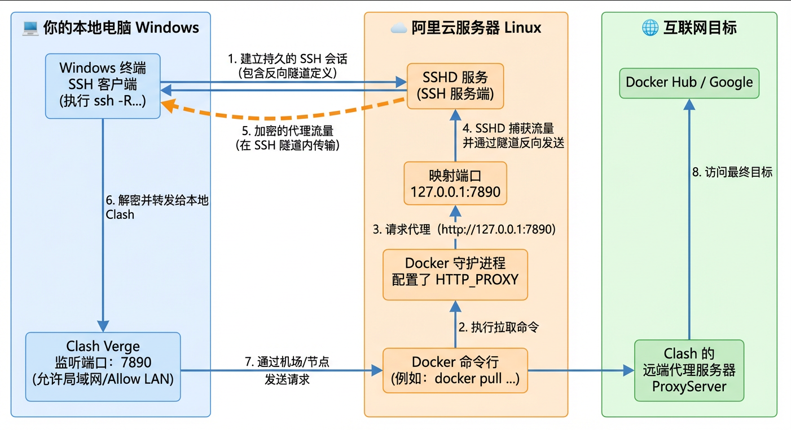

# Docker镜像加速


要让阿里云服务器通过你本地电脑的 **Clash Verge** 上网，最稳妥且不需要额外安装复杂软件的方法是使用 **反向SSH 隧道 (Reverse Proxy)**。


## 1. 操作

### 第一步：配置本地 Clash Verge

**开启局域网连接**：在 Clash Verge 的设置中，确保 **"Allow LAN"** (允许局域网) 开关是 **ON**。

**查看端口**：默认通常是 `7897`。

**查看本地局域网 IP**：在你的 Windows 电脑终端输入 `ipconfig`，找到类似 `192.168.x.x` 的 IP（假设为 `192.168.1.5`）。


### 第二步：建立反向 SSH 隧道

需要从 **Windows 电脑** 连接到阿里云服务器。在 Windows 的 PowerShell 或 CMD 中执行以下命令：

```powershell
# 将本地的 7897 端口映射到阿里云服务器的 7897 端口
# 替换 root 和 111.228.53.183 为你的实际用户名和公网 IP
ssh -R 7897:127.0.0.1:7897 root@111.228.53.183

ssh -R 7895:127.0.0.1:7895 root@192.168.200.10
```

执行后保持这个窗口不要关闭。此时，阿里云服务器的 `127.0.0.1:7890` 就等同于你本地电脑的代理端口。


### 第三步：配置 Docker 代理

现在阿里云服务器已经可以通过隧道访问代理了，接下来配置 Docker 守护进程

1. 创建 Docker 代理目录

```bash
sudo mkdir -p /etc/systemd/system/docker.service.d
```

2. 创建代理配置文件

```bash
sudo vim /etc/systemd/system/docker.service.d/http-proxy.conf
```

3. 写入以下内容（注意这里使用 127.0.0.1）

```ini
[Service]
Environment="HTTP_PROXY=http://127.0.0.1:7895"
Environment="HTTPS_PROXY=http://127.0.0.1:7895
Environment="NO_PROXY=localhost,127.0.0.1,mirrors.aliyun.com"
```

4. 重新加载并重启 Docker

```bash
sudo systemctl daemon-reload
sudo systemctl restart docker
```


### 第四步：验证与拉取镜像

在阿里云服务器上测试网络是否通畅：

```bash
# 测试能否访问 Google
curl -I https://www.google.com --proxy http://127.0.0.1:7895

# 拉取 Milvus 镜像
docker pull milvusdb/milvus:v2.4.0
```


## 2. 原理图

